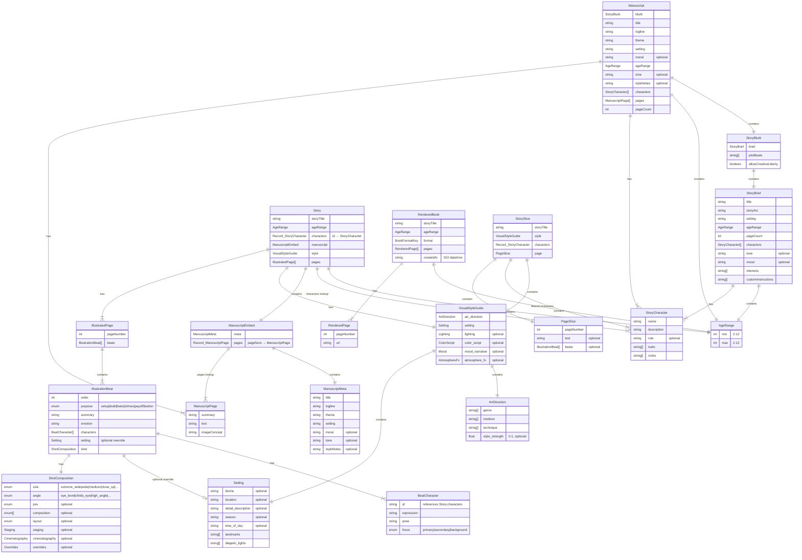

# Bookbug Type Diagram



## Pipeline Flow

```
┌─────────────┐     ┌─────────────┐     ┌─────────────┐     ┌─────────────┐     ┌──────────────┐
│ StoryBrief  │────▶│ StoryBlurb  │────▶│ Manuscript  │────▶│   Story     │────▶│ RenderedBook │
└─────────────┘     └─────────────┘     └─────────────┘     └─────────────┘     └──────────────┘
       │                   │                   │                   │                    │
       ▼                   ▼                   ▼                   ▼                    ▼
  Chat Intake         Blurb Iteration      Author Agent      Illustrator Agent    Renderer Agent
  (conversation)      (plot beats)         (write text)      (visual direction)   (image gen)
```

## Agent Types

| Agent | Input | Output | File |
|-------|-------|--------|------|
| `interpreterAgent` | `string` + `Partial<StoryBrief>` | `Partial<StoryBrief>` | `interpreter.ts` |
| `conversationAgent` | `Partial<StoryBrief>` + `Message[]` | `ConversationResponse` | `conversation.ts` |
| `blurbGeneratorAgent` | `StoryBrief` | `StoryBlurb` | `blurb-generator.ts` |
| `blurbConversationAgent` | `StoryBlurb` + `BlurbMessage[]` | `BlurbConversationResponse` | `blurb-conversation.ts` |
| `blurbInterpreterAgent` | `string` + `StoryBlurb` | `StoryBlurb` | `blurb-interpreter.ts` |
| `authorAgent` | `StoryBlurb` | `Manuscript` | `author.ts` |
| `illustratorAgent` | `Manuscript` | `Story` | `illustrator.ts` |
| `renderPage` | `Story` + `pageNumber` | `RenderedPage` | `renderer.ts` |
| `createBook` | `Story` + `RenderedPage[]` | `RenderedBook` | `renderer.ts` |
| `detectApproval` | `string` | `boolean` | `approval-detector.ts` |

## Conversation Response Types

```typescript
ConversationResponse {
    question: string
    chips: string[]
    isComplete: boolean
}

BlurbConversationResponse {
    message: string
    chips: string[]
    isApproved: boolean
}
```

## Book Formats

| Key | Name | Width | Height | Aspect |
|-----|------|-------|--------|--------|
| `square-small` | Small Square | 1024 | 1024 | 1:1 |
| `square-large` | Large Square | 1440 | 1440 | 1:1 |
| `landscape` | Landscape | 1792 | 1024 | 7:4 |
| `portrait-small` | Portrait Small | 1024 | 1280 | 4:5 |
| `portrait-large` | Portrait Large | 1024 | 1792 | 4:7 |
